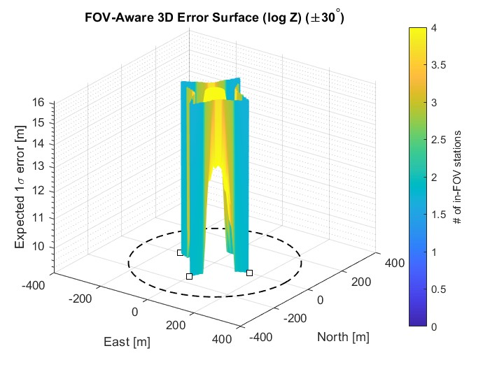

# UAV_Monitoring_Using_5G_Stations
Code Base for Simulations and testing of UAV monitoring using 5G base stations are low altitude radars

3D Fused-Error Surfaces (by number of base stations)

Each row shows the 3D surface of expected 1-σ fused position error over the operational area for a given number of base stations (BS). Warmer colors indicate larger expected error.

1 BS

  
 
<b>3D fused error surface (1 BS):</b> Error is lowest near the single site and grows rapidly away from boresight due to limited angular diversity.

2 BS

  
 
<b>3D fused error surface (2 BS):</b> Overlap between the two inward-facing sectors reduces error along the bisector; blind wedges remain.

3 BS

  
 
<b>3D fused error surface (3 BS):</b> Triangulation improves central region; gaps align with FOV edges.

4 BS

  
 
<b>3D fused error surface (4 BS):</b> Cross-view overlap yields markedly lower interior error.

6 BS

  
 
<b>3D fused error surface (6 BS):</b> Denser angular diversity flattens the error landscape over most of the area.

8 BS

  
 
<b>3D fused error surface (8 BS):</b> Multiple overlapping looks minimize fused uncertainty except at sector boundaries.

Coverage vs. Error Heatmaps (by number of base stations)

For each BS count we show (left) coverage/overlap and (right) absolute-error heatmap.

1 BS

   
 
<b>1 BS:</b> Single sector coverage; error grows quickly off-boresight.

2 BS

   
 
<b>2 BS:</b> Overlap along the mid-region reduces error; edges remain weakly constrained.

3 BS

   
 
<b>3 BS:</b> Three-way overlap stabilizes the center; error lobes track FOV gaps.

4 BS

   
 
<b>4 BS:</b> Robust interior coverage; lower errors where ≥3 sectors overlap.

6 BS

   
 
<b>6 BS:</b> High overlap density; residual warm zones align with residual sector boundaries.

8 BS

   
 
<b>8 BS:</b> Extensive joint visibility; error falls below target thresholds across most of the area.

Side-by-Side Comparisons
3D Surfaces — All BS Counts

    
 
    
 
<b>Trend:</b> Increasing BS count flattens the error surface and improves uniformity.

Coverage Maps — All BS Counts

    
 
    
 
<b>Trend:</b> More sites ⇒ more overlap ⇒ stronger observability in the interior.

Error Heatmaps — All BS Counts

    
 
    
 
<b>Trend:</b> Absolute position error decreases and becomes more uniform as BS count increases.

